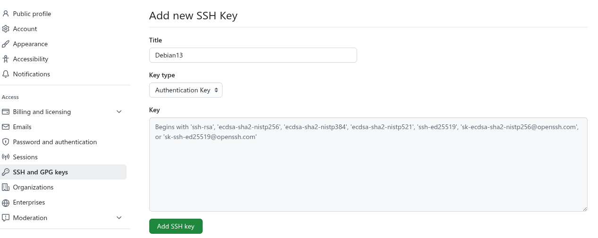
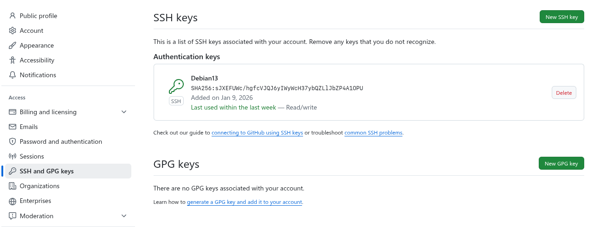
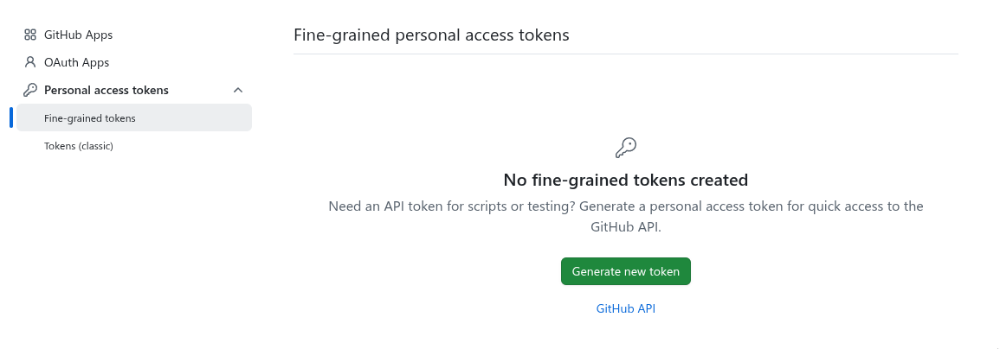
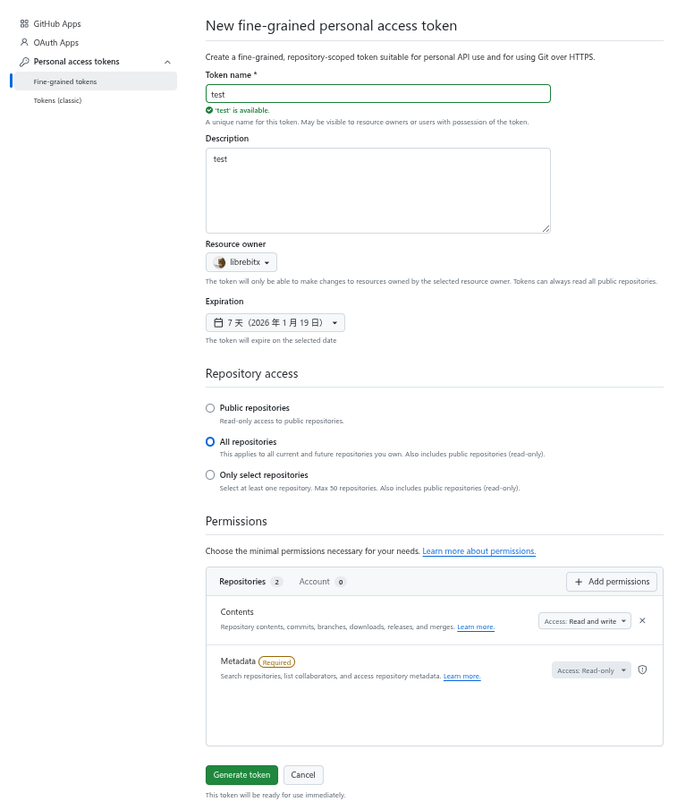
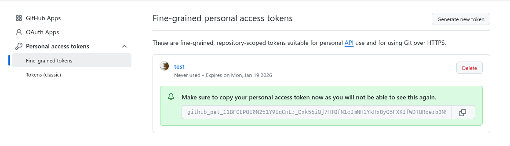
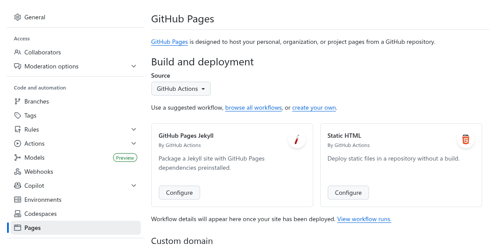
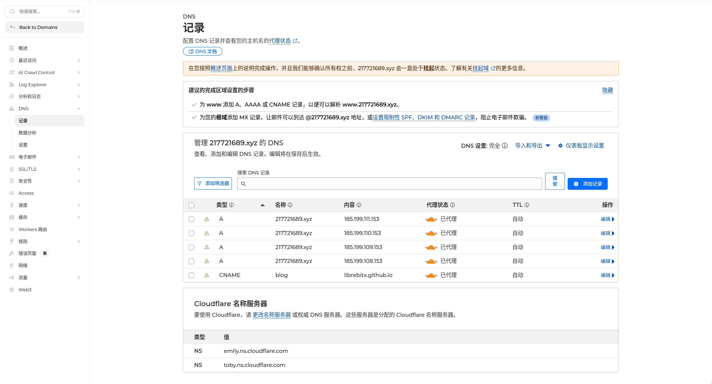
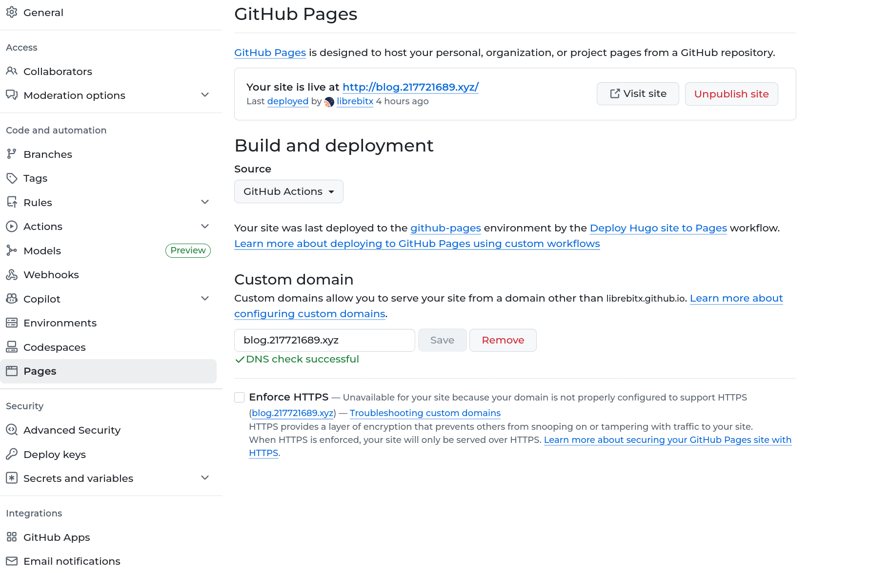

# 什么是 Git？

**Git** 是一个**分布式版本控制系统**（Distributed Version Control System），由 Linus Torvalds（Linux 内核创始人）在2005年开发，主要用来管理代码和文件的历史版本。
Git 是管理代码版本的工具，帮助团队协作和代码管理，让开发更高效、更安全。
Git 可以随时回到之前的版本；多人可以同时修改代码；能合并和管理冲突；可以在不同分支上开发不同功能，互不干扰；代码历史存在本地和远程，防止丢失。
# 安装与配置

 [git-scm.com](https://git-scm.com/) 

```bash
# mac
sudo brew install git
# deb
sudo apt-get install git
```

下载安装完成后，需要告诉 Git 你是谁。

在giyhub 上这步必须做，否则不会显示提交）。

```bash
# 设置你的名字
git config --global user.name "用户名"

# 设置你的邮箱
git config --global user.email "邮箱@example.com"
# Git 的设计哲学是责任到人。 
# 当你以后使用 git commit（提交存档）命令时，Git 必须知道这行代码是谁写的。 
# Git 会自动把你设置的“名字”和“邮箱”烙印在那个版本（Commit）里。

# 配置本地代理
git config --global http.proxy http://127.0.0.1:7890
git config --global https.proxy http://127.0.0.1:7890

# 取消代理
git config --global --unset http.proxy
git config --global --unset https.proxy
```
# 常用命令

> git init、git status、git add、git commit、git log

```bash
~/git$ git init			# 初始化仓库，默认创建一个初始分支 main ，分支只是一个指针，指向你仓库里的某次提交 (Commit)。
提示： 使用 'master' 作为初始分支的名称。这个默认分支名称可能会更改。要在新仓库中
提示： 配置使用初始分支名，并消除这条警告，请执行：
提示：
提示： 	git config --global init.defaultBranch <名称>
提示：
提示： 除了 'master' 之外，通常选定的名字有 'main'、'trunk' 和 'development'。
提示： 可以通过以下命令重命名刚创建的分支：
提示：
提示： 	git branch -m <name>
已初始化空的 Git 仓库于 /home/libix/git/.git/
~/git$ git status			# 查看状态
位于分支 master

尚无提交

无文件要提交（创建/拷贝文件并使用 "git add" 建立跟踪）
~/git$ touch readme.txt
~/git$ echo "test" > readme.txt
~/git$ git add readme.txt			# 将修改文件添加到暂存区
~/git$ git add .				# 把所有修改的文件都放进去
~/git$ git commit -m "01"			# 提交存档，把暂存区的内容正式生成一个版本（快照）。必须写备注！
[master（根提交） 677d2f3] 01
 1 file changed, 1 insertion(+)
 create mode 100644 readme.txt
~/git$ git log			# 查看提交记录
commit 677d2f3a1e55939ac87db3fa262c032c8c103414 (HEAD -> master)
Author: libix <younglibix@outlook.com>
Date:   Mon Jan 12 01:32:12 2026 +0800

    01
~/git$ 
~/git$ cd ..
~$ rm -rf learngit/			# 删除 Git
~$ 
```
# 分支管理

> git branch、git checkout、git switch、git show、git merge

这是 Git 最强大的功能。你可以创建一个“分支”去尝试新功能，如果搞砸了，直接删掉分支，完全不会影响主线（main/master）的代码。
```bash
~/git$ git branch feature			# 新建分支 feature
# 当你从 master 分支创建一个新分支，这个新分支会从 master 当前的状态（包括所有文件和提交）“拷贝”过来，拥有和 master 分支一样的内容。
~/git$ git status
位于分支 master
无文件要提交，干净的工作区
~/git$ 
~/git$ git branch			# 查看本地分支
  feature
* master
~/git$ git branch -r		# 查看远程分支
~/git$ git branch -a		# 查看全部分支
  feature
* master
~/git$ git checkout feature			# 切换分支
切换到分支 'feature'
~/git$ git branch -a
* feature
  master
~/git$ git branch -m master main		# 重命名分支
~/git$ git branch -a
* feature
  main
~/git$ git branch -m main master
~/git$ git switch -c test			# 创建并切换分支
切换到一个新分支 'test'
~/git$ git branch -a
  feature
  master
* test
~/git$ 
~/git$ git switch -c test
切换到一个新分支 'test'
~/git$ git branch -a
  feature
  master
* test
~/git$ git show			# 显示当前分支最新提交的详细信息
commit 677d2f3a1e55939ac87db3fa262c032c8c103414 (HEAD -> test, master, feature)
Author: libix <younglibix@outlook.com>
Date:   Mon Jan 12 01:32:12 2026 +0800

    01

diff --git a/readme.txt b/readme.txt
new file mode 100644
index 0000000..9daeafb
--- /dev/null
+++ b/readme.txt
@@ -0,0 +1 @@
+test
~/git$ 
~/git$ git status
位于分支 test
无文件要提交，干净的工作区
~/git$ ls
readme.txt
~/git$ touch test
~/git$ echo "01" > test
~/git$ git status
位于分支 test
未跟踪的文件:
  （使用 "git add <文件>..." 以包含要提交的内容）
	test

提交为空，但是存在尚未跟踪的文件（使用 "git add" 建立跟踪）
~/git$ 
~/git$ git add .
~/git$ git status
位于分支 test
要提交的变更：
  （使用 "git restore --staged <文件>..." 以取消暂存）
	新文件：   test

~/git$ git commit -m "02"
[test ae45343] 02
 1 file changed, 1 insertion(+)
 create mode 100644 test
~/git$ git status
位于分支 test
无文件要提交，干净的工作区
~/git$ ls
readme.txt  test
~/git$ git checkout master
切换到分支 'master'
~/git$ ls
readme.txt
~/git$ git status
位于分支 master
无文件要提交，干净的工作区
~/git$ git merge test			# 合并分支
更新 677d2f3..ae45343
Fast-forward
 test | 1 +
 1 file changed, 1 insertion(+)
 create mode 100644 test
~/git$ ls
readme.txt  test
~/git$ git switch feature
切换到分支 'feature'
~/git$ ls
readme.txt
~/git$ touch {a,b,c}.txt
~/git$ ls
a.txt  b.txt  c.txt  readme.txt
~/git$ git branch -d feature
错误：无法强制更新被工作区 '/home/libix/git' 所使用的分支 'feature'
~/git$ git switch master
切换到分支 'master'
~/git$ git branch -d feature			# 删除分支，但如果分支有未合并的修改，会报错，防止误删
已删除分支 feature（曾为 677d2f3）。
~/git$ ls
a.txt  b.txt  c.txt  readme.txt  test
~/git$ git status
位于分支 master
未跟踪的文件:
  （使用 "git add <文件>..." 以包含要提交的内容）
	a.txt
	b.txt
	c.txt

提交为空，但是存在尚未跟踪的文件（使用 "git add" 建立跟踪）
~/git$ 
# Git 默认不会删除工作目录中的未跟踪文件（新文件、改动没被commit的文件），也不会强制覆盖它们。
~/git$ git switch test
切换到分支 'test'
~/git$ git add .
~/git$ git status
位于分支 test
要提交的变更：
  （使用 "git restore --staged <文件>..." 以取消暂存）
	新文件：   a.txt
	新文件：   b.txt
	新文件：   c.txt

~/git$ git restore --staged .			# 把指定文件从暂存区撤回到工作区
~/git$ git status
位于分支 test
未跟踪的文件:
  （使用 "git add <文件>..." 以包含要提交的内容）
	a.txt
	b.txt
	c.txt

提交为空，但是存在尚未跟踪的文件（使用 "git add" 建立跟踪）
~/git$ git add a.txt b.txt 
~/git$ git commit -m "o4-test"
[test ee6d6ba] o4-test
 2 files changed, 0 insertions(+), 0 deletions(-)
 create mode 100644 a.txt
 create mode 100644 b.txt
~/git$ 
~/git$ git status
位于分支 test
未跟踪的文件:
  （使用 "git add <文件>..." 以包含要提交的内容）
	c.txt

提交为空，但是存在尚未跟踪的文件（使用 "git add" 建立跟踪）
~/git$ 
~/git$ git switch master
切换到分支 'master'
~/git$ ls
c.txt  readme.txt  test
~/git$ git branch -d test
错误：分支 'test' 没有完全合并
提示： 如果您确认要删除它，执行 'git branch -D test'
提示： Disable this message with "git config advice.forceDeleteBranch false"
~/git$ 
~/git$ git branch -D test			# 强制删除本地分支
已删除分支 test（曾为 ee6d6ba）。
~/git$ git branch
* master
~/git$ 
```
# 远程协作

> git clone、git push、git pull

```bash
~/git$ git clone https://github.com/librebitx/librebitx.github.io.git
...
~/git$ cd librebitx.github.io
~/git/librebitx.github.io$ git remote -v
origin	https://github.com/librebitx/librebitx.github.io.git (fetch)
origin	https://github.com/librebitx/librebitx.github.io.git (push)
~/git/librebitx.github.io$ 
~/git/librebitx.github.io$ git push 
~/git/librebitx.github.io$ git remote -v
origin  https://github.com/librebitx/librebitx.github.io.git (fetch)
origin  https://github.com/librebitx/librebitx.github.io.git (push)
~/git/librebitx.github.io$ 
~/git/librebitx.github.io$ rm -rf *
~/git/librebitx.github.io$ ls
~/git/librebitx.github.io$ ls -a
.  ..  .git
# Git 仓库还在！
# .git/ 还在，git status 还能用，你只是把工作区清空了
# Git ≈ .git 目录，没有 .git，就没有 Git 仓库
~/git/librebitx.github.io$ git status
位于分支 main
您的分支与上游分支 'origin/main' 一致。

尚未暂存以备提交的变更：
  （使用 "git add/rm <文件>..." 更新要提交的内容）
  （使用 "git restore <文件>..." 丢弃工作区的改动）
	删除：     LICENSE
	删除：     README.md
	删除：     _config.yml
	删除：     _layouts
	删除：     _posts
	删除：     public
	删除：     css
	删除：     index.html
	删除：     resume.html
	删除：     upload.sh

修改尚未加入提交（使用 "git add" 和/或 "git commit -a"）
~/git/librebitx.github.io$ touch test.txt
~/git/librebitx.github.io$ git add .
~/git/librebitx.github.io$ git commit -m "test"
[main 2e84897] test
 19 files changed, 6765 deletions(-)
...
~/git/librebitx.github.io$ 
~/git/librebitx.github.io$ git push origin main:test		# 把本地分支提交到远程仓库的其他分支（没有则创建）
Username for 'https://github.com': librebitx
Password for 'https://librebitx@github.com': 
remote: Invalid username or token. Password authentication is not supported for Git operations.
致命错误：'https://github.com/librebitx/librebitx.github.io.git/' 鉴权失败
# GitHub 已经彻底禁用了“密码登录”。

### 两种解决方案：
# SSH Key（一次配置，终身舒服）；这是企业/运维/后端/开源项目的标准做法。
# Personal Access Token（不推荐长期用），适合：临时/CI/没法用 SSH 的环境
~/git/librebitx.github.io$ git push origin main:test
Username for 'https://github.com': librebitx
Password for 'https://librebitx@github.com': < 粘贴创建的 Token >
枚举对象中: 4, 完成.
对象计数中: 100% (4/4), 完成.
使用 16 个线程进行压缩
压缩对象中: 100% (1/1), 完成.
写入对象中: 100% (3/3), 234 字节 | 234.00 KiB/s, 完成.
总共 3（差异 0），复用 1（差异 0），包复用 0（来自  0 个包）
remote: 
remote: Create a pull request for 'test' on GitHub by visiting:
remote:      https://github.com/librebitx/librebitx.github.io/pull/new/test
remote: 
To https://github.com/librebitx/librebitx.github.io.git
 * [new branch]      main -> test
~/git/librebitx.github.io$ git branch -a
* main
  remotes/origin/HEAD -> origin/main
  remotes/origin/main
  remotes/origin/test
~/git/librebitx.github.io$ 
~/git/librebitx.github.io$ git pull origin test		# 把云端最新的代码更新到你本地
remote: Enumerating objects: 4, done.
remote: Counting objects: 100% (4/4), done.
remote: Compressing objects: 100% (2/2), done.
remote: Total 3 (delta 0), reused 0 (delta 0), pack-reused 0 (from 0)
展开对象中: 100% (3/3), 946 字节 | 946.00 KiB/s, 完成.
来自 https://github.com/librebitx/librebitx.github.io
 * branch            test       -> FETCH_HEAD
   2e84897..e49b2d4  test       -> origin/test
更新 2e84897..e49b2d4
Fast-forward
 testpull | 1 +
 1 file changed, 1 insertion(+)
 create mode 100644 testpull
~/git/librebitx.github.io$ ls
testpull  test.txt
~/git/librebitx.github.io$ 
~/git/librebitx.github.io$ git push origin --delete test			# 删除远程分支
...
To https://github.com/librebitx/librebitx.github.io.git
 - [deleted]         test
~/git/librebitx.github.io$ git branch -a
* main
  remotes/origin/HEAD -> origin/main
  remotes/origin/main
~/git/librebitx.github.io$ 
```

## 添加 SSH Key

``` bash
# 创建密钥
ssh-keygen -t ed25519 -C "librebitx@github"
cat ~/.ssh/id_ed25519.pub
```





## 关联远程仓库

网上克隆了一个仓库之后怎么提交代码呢？


```bash
~/github/Journey$ git remote add origin https://github.com/librebitx/Journey.git			# 关联远程仓库
~/github/Journey$ git push -u origin main
错误：源引用规格 main 没有匹配
错误：无法推送一些引用到 'https://github.com/librebitx/Journey.git'
~/github/Journey$ 
~/github/Journey$ git push -u origin main
Username for 'https://github.com': ^C
~/github/Journey$ git remote set-url origin git@github.com:librebitx/Journey.git			# 将远程地址切换为 SSH 模式
~/github/Journey$ git push -u origin main
To github.com:librebitx/Journey.git
 ! [rejected]        main -> main (fetch first)
错误：无法推送一些引用到 'github.com:librebitx/Journey.git'
提示： 更新被拒绝，因为远程仓库包含您本地尚不存在的提交。这通常是因为另外
提示： 一个仓库已向该引用进行了推送。如果您希望先与远程变更合并，请在推送
提示： 前执行 'git pull'。
提示： 详见 'git push --help' 中的 'Note about fast-forwards' 小节。
~/github/Journey$ 
~/github/Journey$ git push -u origin main -f
枚举对象中: 58, 完成.
对象计数中: 100% (58/58), 完成.
使用 16 个线程进行压缩
压缩对象中: 100% (53/53), 完成.
写入对象中: 100% (58/58), 374.04 KiB | 1.47 MiB/s, 完成.
总共 58（差异 0），复用 0（差异 0），包复用 0（来自  0 个包）
To github.com:librebitx/Journey.git
 + ef958d6...a0e6bfe main -> main (forced update)
分支 'main' 设置为跟踪 'origin/main'。
~/github/Journey$ 
```

## Personal Access Token

**创建 Token**
GitHub → Settings → Developer settings → Personal access tokens → **Fine-grained tokens**
权限至少要有：Contents: Read & Write







# 问题解决

## 恢复提交

> git restore、git reset、git revert

如果发现刚才在 `main` 分支上改的代码全都改错了，怎么把这个文件**恢复到上一次提交时的样子**（抛弃当前工作区的所有修改）

```bash
~/git/librebitx.github.io$ echo "01" > test
~/git/librebitx.github.io$ git add .
~/git/librebitx.github.io$ git commit -m "test-restore"
[main 766f218] test-restore
 1 file changed, 1 insertion(+)
 create mode 100644 test
~/git/librebitx.github.io$ echo "xcbsdch" > test
~/git/librebitx.github.io$ git add 
没有指定文件，也没有文件被添加。
提示： 也许您想要执行 'git add .'？
提示： Disable this message with "git config advice.addEmptyPathspec false"
~/git/librebitx.github.io$ git add .
~/git/librebitx.github.io$ git commit -m "test-restore-errorcommit"
[main 75891bb] test-restore-errorcommit
 1 file changed, 1 insertion(+), 1 deletion(-)
~/git/librebitx.github.io$
### git restore 只能撤销未提交的修改；一旦 git commit 了，历史就定型了，git restore 不会生效
~/git/librebitx.github.io$ git restore test
~/git/librebitx.github.io$ cat test
xcbsdch
~/git/librebitx.github.io$ git log --oneline
75891bb (HEAD -> main) test-restore-errorcommit
766f218 test-restore
~/git/librebitx.github.io$ git reset --hard 766f218			# 撤销提交，会修改历史
HEAD 现在位于 766f218 test-restore
# 后面的提交 test-restore-errorcommit 消失了
~/git/librebitx.github.io$ cat test
01
~/git/librebitx.github.io$ git log --oneline
766f218 (HEAD -> main) test-restore

~/git/librebitx.github.io$ rm -rf ./*
~/git/librebitx.github.io$ echo "aa" > test-revert 
~/git/librebitx.github.io$ git add .
~/git/librebitx.github.io$ git commit -m "aa"
[main 01f8f88] aa
 1 file changed, 1 insertion(+), 1 deletion(-)
~/git/librebitx.github.io$ git push origin main:test
...
~/git/librebitx.github.io$ echo "01" > test-revert 
~/git/librebitx.github.io$ git add .
~/git/librebitx.github.io$ git commit -m "01"
[main bd7cec3] 01
 1 file changed, 1 insertion(+), 1 deletion(-)
~/git/librebitx.github.io$ git push origin main:test
...
~/git/librebitx.github.io$ git log --oneline
bd7cec3 (HEAD -> main, origin/test) 01
01f8f88 aa
~/git/librebitx.github.io$ git revert bd7cec3				# 撤销提交，不会修改历史
[main b510a9c] Revert "01"
 1 file changed, 1 insertion(+), 1 deletion(-)
~/git/librebitx.github.io$ 
~/git/librebitx.github.io$ cat test-revert
aa
~/git/librebitx.github.io$ git log --oneline
b510a9c (HEAD -> main) Revert "01"
bd7cec3 (origin/test) 01
01f8f88 aa
### 此时虽然本地撤销了 01 提交，远程并没有改变
~/git/librebitx.github.io$ git fetch origin			# 更新远程信息（不改你本地文件）只拉取元数据，不会改你工作区
~/git/librebitx.github.io$ git ls-tree -r origin/test --name-only			# 查看远程分支树
test-revert
~/git/librebitx.github.io$ git switch --detach origin/test			# 只读状态进入远程分支
HEAD 目前位于 bd7cec3 01
~/git/librebitx.github.io$ ls
test-revert
~/git/librebitx.github.io$ cat test-revert 
01
~/git/librebitx.github.io$ git switch main
之前的 HEAD 位置是 bd7cec3 01
切换到分支 'main'
您的分支领先 'origin/main' 共 8 个提交。
  （使用 "git push" 来发布您的本地提交）
~/git/librebitx.github.io$ cat test-revert
aa
~/git/librebitx.github.io$ 
```

## 忽略文件
项目里会有很多不需要 Git 记录的文件，比如：
项目编译生成的临时文件（`.exe`, `.o`, `dist/`）
你个人的密码配置文件（`.env`）
如果你不处理，`git status` 会一直显示这堆垃圾文件，非常烦人，而且一旦误提交了密码到 GitHub，后果很严重。

```bash

```


## 解决冲突
你和你的同事（或者你自己的两个分支）修改了**同一个文件**的**同一行**内容，并且内容还不一样。当你尝试合并（`git merge`）时，Git 无法自动决定保留谁的，只能报错。

## 清理提交历史
当克隆一个项目时可能有几百条提交历史，有时会很杂乱，而且会拖慢 clone 速度。
注意：**公共项目要慎用！**

```bash
~/github/lib$ ls -a
.  ..  public  _config.yml  css  .git  index.html  _layouts  LICENSE  _posts  README.md  resume.html  upload.sh
~/github/lib$ rm -rf .git
~/github/lib$ 
~/github/lib$ git init
提示： 使用 'master' 作为初始分支的名称。这个默认分支名称可能会更改。要在新仓库中
提示： 配置使用初始分支名，并消除这条警告，请执行：
提示：
提示： 	git config --global init.defaultBranch <名称>
提示：
提示： 除了 'master' 之外，通常选定的名字有 'main'、'trunk' 和 'development'。
提示： 可以通过以下命令重命名刚创建的分支：
提示：
提示： 	git branch -m <name>
已初始化空的 Git 仓库于 /home/libix/github/lib/.git/
~/github/lib$ git branch
~/github/lib$ git branch -M main
~/github/lib$ git branch
~/github/lib$ git branch -M main
~/github/lib$ 
~/github/lib$ git add .
~/github/lib$ git commit -m "Initial commit"
[main（根提交） 3033a10] Initial commit
 20 files changed, 7078 insertions(+)
 create mode 100644 LICENSE
 create mode 100644 README.md
 create mode 100644 _config.yml
 create mode 100644 _layouts
 create mode 100644 _posts
 create mode 100644 public
 create mode 100644 css
 create mode 100644 index.html
 create mode 100644 resume.html
 create mode 100755 upload.sh
~/github/lib$ git remote set-url origin git@github.com:librebitx/librebitx.github.io.git
~/github/lib$ 
~/github/lib$ git remote -v
origin	git@github.com:librebitx/librebitx.github.io.git (fetch)
origin	git@github.com:librebitx/librebitx.github.io.git (push)
~/github/lib$ 
~/github/lib$ git push -u origin main
枚举对象中: 28, 完成.
对象计数中: 100% (28/28), 完成.
使用 16 个线程进行压缩
压缩对象中: 100% (26/26), 完成.
写入对象中: 100% (28/28), 340.37 KiB | 1.04 MiB/s, 完成.
总共 28（差异 0），复用 0（差异 0），包复用 0（来自  0 个包）
To github.com:librebitx/librebitx.github.io.git
 + 80c7ffb...3033a10 main -> main (forced update)
~/github/lib$ 
~/github/lib$ git log
commit 3033a103d9b34ad2b719acefb9a99f577205cf10 (HEAD -> main, origin/main)
Author: libix <younglibix@outlook.com>
Date:   Mon Jan 12 23:44:48 2026 +0800

    Initial commit
~/github/lib$ 
~/github/lib$ git status
位于分支 main
您的分支与上游分支 'origin/main' 一致。

无文件要提交，干净的工作区
~/github/lib$ 
```

## 信任目录

解决 git 目录移动后无法提交问题

```bash
/srv/samba/share01$ cd Desktop/lib/
/srv/samba/lib$ 
/srv/samba/lib$ ./update.sh 
❌ 错误: 当前目录不是 Git 仓库。
/srv/samba/lib$ ls
C  _config.yml  css  _includes  index.html  _layouts  LICENSE  _posts  public  README.md  shell  terraform  update.sh
/srv/samba/lib$ 
/srv/samba/lib$ git config --global --add safe.directory /srv/samba/lib
/srv/samba/lib$ 
/srv/samba/lib$ ./update.sh 
📂 未指定具体文件，执行全局 Git 同步...
----------------------------------------
📝 请输入提交信息 (回车使用默认值):
Commit msg [Updated some content 2026/02/07-21:05:00] > 
[main 7f6bf13] Updated some content 2026/02/07-21:05:00
 66 files changed, 162 insertions(+), 51 deletions(-)
...
✅ 提交成功
🚀 正在推送...
Enumerating objects: 41, done.
Counting objects: 100% (41/41), done.
Delta compression using up to 16 threads
Compressing objects: 100% (18/18), done.
Writing objects: 100% (21/21), 3.87 KiB | 1.94 MiB/s, done.
Total 21 (delta 12), reused 0 (delta 0), pack-reused 0 (from 0)
remote: Resolving deltas: 100% (12/12), completed with 11 local objects.
To github.com:librebitx/librebitx.github.io.git
   4dbcc65..7f6bf13  main -> main
🎉 完成!
/srv/samba/lib$ 
```


# GitHub Pages

## Hugo

部署 Hugo 要确保仓库的 Pages 选项选择 GitHub Actions




## 配置使用自定义域名





