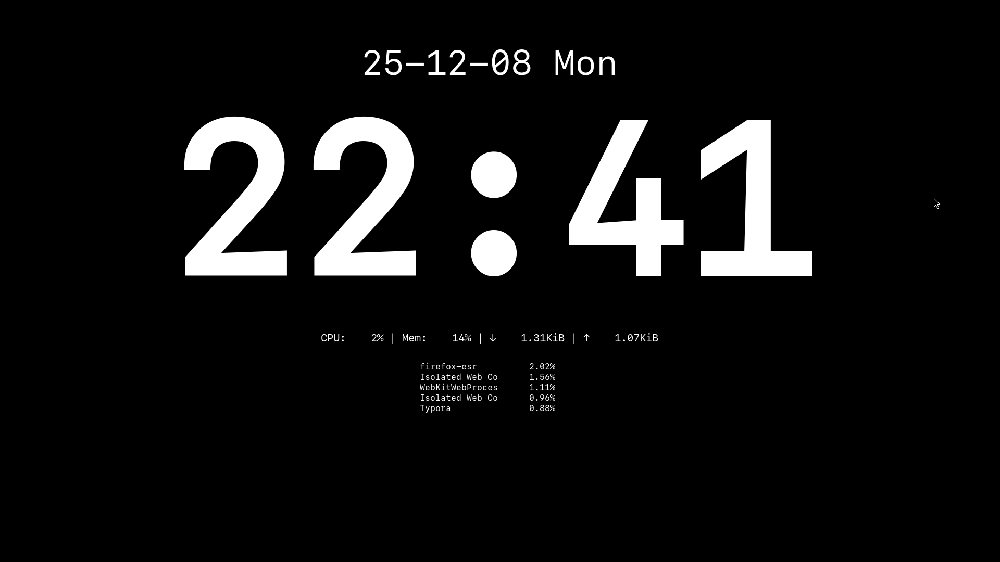

## 系统配置

```bash
su -

cat <<EOL> /etc/apt/sources.list
deb https://mirrors.tuna.tsinghua.edu.cn/debian/ trixie main contrib non-free non-free-firmware
deb https://mirrors.tuna.tsinghua.edu.cn/debian/ trixie-updates main contrib non-free non-free-firmware
deb https://mirrors.tuna.tsinghua.edu.cn/debian-security/ trixie-security main contrib non-free non-free-firmware
EOL

apt update
apt install sudo vim
usermod -aG sudo libix

reboot
```

## 桌面

Gnome

```bash
# 显示 Dock 栏
sudo apt install gnome-shell-extension-manager        # 安装扩展管理器
```

openbox

```bash
sudo apt install xorg openbox obconf lxappearance xdg-desktop-portal xdg-desktop-portal-gtk
# obconf 是 Openbox 的图形配置工具，它编辑的是 ~/.config/openbox/rc.xml
# lxappearance 可以设置主题、图标主题、鼠标主题、字体
# xdg-desktop-portal xdg-desktop-portal-gtk 用于跨应用交互（如文件对话框、输入法集成、主题同步）的后端组件
# 启动 openbox
startx
obmenu obmenu-generator nitrogen picom 
```

进入 openbox 后，右击鼠标选择打开终端，默认的 Xterm 缺少太多功能，需要安装终端

```bash
sudo apt install lxterminal
lxtermianl &
```

### sway

```
# 配置文件
mkdir -p ~/.config/sway
sudo cp /etc/sway/config ~/.config/sway/
sudo chown -R $USER:$USER ~/.config/sway/


```


## 主菜单

**menu.xml** 文件定义了 openbox 主菜单的结构和选项，可以鼠标右击桌面或设置快捷键打开，下面是一个小模板示范，大家可以根据自己喜好自定义，系统默认配置在 `/etc/xdg/openbox/menu.xml`

```bash
openbox --reconfigure        # 刷新 openbox 配置，也可以右击鼠标点击 Restart
```


## 输入法

Fcitx5 是目前 Linux 社区公认的输入法框架第一选择。

与 IBus 相比，Fcitx5 的后台常驻进程更少，内存占用更小。

```bash
sudo apt install fcitx5 fcitx5-chinese-addons fcitx5-config-qt fcitx5-frontend-gtk2 fcitx5-frontend-gtk3 fcitx5-frontend-qt5

# 配置输入法环境变量
~$ cat ~/.xprofile
#!bin/bash

export GTK_IM_MODULE=fcitx
export QT_IM_MODULE=fcitx
export XMODIFIERS=@im=fcitx
~$ im-config -n fcitx
~$ cat ~/.xinputrc
# im-config(8) generated on Sat, 17 Jan 2026 03:28:00 +0800
run_im fcitx
# im-config signature: 74bf5c2c7f1d4fa423ebe59063385eb9  -
~$ 
```

以下是关于 fcitx5 皮肤安装的链接：

[https://github.com/hosxy/Fcitx5-Material-Color](https://github.com/hosxy/Fcitx5-Material-Color)

[https://github.com/thep0y/fcitx5-themes-candlelight](https://github.com/thep0y/fcitx5-themes-candlelight)

## 快捷键

快捷键的配置文件 rc.xml 其中也包括了 openbox 主题的配置信息，需要创建在用户家目录下。

系统默认配置在 `/etc/xdg/openbox/rc.xml`。

```bash
mkdir -p ~/.config/openbox
touch ~/.config/openbox/rc.xml


openbox --reconfigure
```

## 剪贴板

openbox 默认不支持复制粘贴图片

```bash
~$ cat shell/maimshot.sh 
#!/bin/bash

# 截图保存地址
DIR="/home/libix/Pictures/screenshots"

# 截图名称
FILE="$DIR/$(date +%Y-%m-%d_%H:%M:%S).png"

# 选区截图 -> 保存 -> 同时复制到剪贴板
maim -s "$FILE" && xclip -selection clipboard -t image/png < "$FILE"
~$ 
```

## 截图

```bash
sudo apt install maim xclip

~$ cat maimshot.sh 
#!/bin/bash
# 截图保存地址
DIR="~/Pictures/screenshots"
# 截图名称
FILE="$DIR/$(date +%Y-%m-%d_%H:%M:%S).png"
# 选区截图 -> 保存 -> 同时复制到剪贴板
maim -s "$FILE" && xclip -selection clipboard -t image/png < "$FILE"
~$ 
```

## 主题

### 图标

GTK 主题决定了窗口的样式

```bash
git clone https://gitlab.com/kalilinux/packages/kali-themes.git
mkdir -p ~/.themes
mv kali-themes/share/themes ~/.themes
mkdir -p ~/.icons
mv kali-themes/share/icons ~/.icons

lxappearance &        # 打开主题设置
```

https://www.gnome-look.org/browse?cat=135&ord=latest

**openbox 主题**决定了标题栏样式和菜单样式，使用 obconf 设置

```bash
obconf &
```

https://github.com/addy-dclxvi/openbox-theme-collections

### 字体

在 obconf 中设置标题栏、主菜单字体；
在 lxappearance 中设置桌面显示字体

https://fonts.google.com/

```bash
# 将字体移动到 ~/.local/share/fonts/ 目录下
# 刷新字体缓存

sudo fc-cache -f -v

# 确认字体的系统名

fc-scan /path/to/yourinstallfonts.ttf | grep family
```

### 壁纸

推荐使用 feh 设置桌面壁纸

```bash
feh --bg-fill ~/Pictures/wallpaper.jpg &
```

## 分辨率调整

```bash
~$ xrandr
Screen 0: minimum 320 x 200, current 1920 x 1080, maximum 16384 x 16384
eDP connected primary (normal left inverted right x axis y axis)
   2880x1800    120.00 + 120.00 +  48.00  
   1920x1200    120.00  
   1920x1080    120.00  
   1600x1200    120.00  
   1680x1050    120.00  
   1280x1024    120.00  
   1440x900     120.00  
   1280x800     120.00  
   1280x720     120.00  
   1024x768     120.00  
   800x600      120.00  
   640x480      120.00  
HDMI-A-0 connected 1920x1080+0+0 (normal left inverted right x axis y axis) 527mm x 296mm
   1920x1080     60.00*+  50.00    59.94  
   1680x1050     59.88  
   1600x900      60.00  
   1280x1024     60.02  
   1440x900      59.90  
   1280x800      59.91  
   1280x720      60.00    50.00    59.94  
   1024x768      60.00  
   800x600       60.32  
   720x576       50.00  
   720x480       60.00    59.94  
   640x480       60.00    59.94  
   720x400       70.08  
DisplayPort-0 disconnected (normal left inverted right x axis y axis)
DisplayPort-1 disconnected (normal left inverted right x axis y axis)
DisplayPort-2 disconnected (normal left inverted right x axis y axis)
DisplayPort-3 disconnected (normal left inverted right x axis y axis)
DisplayPort-4 disconnected (normal left inverted right x axis y axis)
DisplayPort-5 disconnected (normal left inverted right x axis y axis)
~$ 

# 设置分辨率（例如 1920×1080）
xrandr --output eDP-1 --mode 1920x1080
```

## 窗口合成器

picom 可以优化显示减少画面撕裂，可以配置透明、阴影、模糊、圆角、动画效果。

[**picom.conf**](https://librebitx.github.io/2026/01/19/Code/#picomconf)

```bash
~$ sudo apt install picom
```

## 显示

```bash
～$ xgamma -gamma 0.8
-> Red  1.000, Green  1.000, Blue  1.000
<- Red  0.800, Green  0.800, Blue  0.800
～$ 
# 默认是 1.0。数值越小（如 0.8 或 0.9），画面中间调越暗，对比度感觉越高，颜色越浓郁，更像 Mac 的调教。
```


## 面板

Polybar 交互式状态栏（能点、能切换、能操作）
Conky 桌面监控仪表（只显示，不交互）

```bash
conky.config = {
    -- 窗口设置
    own_window = true,  -- 启用独立窗口显示模式。避免闪烁，提高性能。
    own_window_type = 'desktop',  -- 显示在桌面层，窗口不会遮挡其他程序
    own_window_transparent = false, -- 背景透明
    own_window_argb_visual = true,
    own_window_argb_value = 0,  -- 0 = 完全透明
    own_window_hints = 'undecorated,below,sticky,skip_taskbar,skip_pager',


    own_window_colour = '#222222', -- 设置窗口背景颜色（这里是黑色）    
    -- 设置窗口类名和窗口标题，方便窗口管理器识别和管理该窗口
    own_window_class = 'Conky',
    own_window_title = 'Conky',

    -- 位置与大小
    alignment = 'center',
    gap_x = 20,    -- 水平边距，距离屏幕边缘 20 像素。
    gap_y = 20,
    minimum_width = 1500, -- 窗口的最小宽度
    maximum_width = 1500,

    -- 绘制参数
    double_buffer = true, -- 双缓冲减少闪烁
    use_xft = true, -- 启用 Xft 字体渲染，支持抗锯齿和更漂亮的字体
    font = 'SF Mono:weight=Light:size=12', -- 默认字体
    xftalpha = 1,
    update_interval = 3,     -- 刷新间隔

    -- 字体颜色设置
    default_color = 'white',
    default_outline_color = 'white', -- 字体轮廓颜色
    default_shade_color = 'white', -- 字体阴影颜色

    -- 边框与背景
    draw_borders = false,
    draw_graph_borders = false, -- 绘制图表的边框
    draw_shades = false,
    draw_outline = false,
}

conky.text = [[
${font SF Mono:weight=Light:size=50}${alignc}${time %y-%m-%d %a}${font}
${font SF Mono:weight=Bold:size=300}${alignc}${time %H:%M}${font}


${font SF Mono:weight=Light:size=15}${alignc}CPU:    ${cpu cpu0}% | Mem:    ${memperc}% | ↓    ${downspeed wlo1} | ↑    ${upspeed wlo1}${font}


${alignc}${top_mem name 1}   ${top_mem mem_res 1}
${alignc}${top_mem name 2}   ${top_mem mem_res 2}
${alignc}${top_mem name 3}   ${top_mem mem_res 3}
${alignc}${top_mem name 4}   ${top_mem mem_res 4}
${alignc}${top_mem name 5}   ${top_mem mem_res 5}

]]
```



```bash
conky.config = {

    own_window = true,
    own_window_type = 'desktop',
    own_window_transparent = true,
    own_window_argb_visual = true,
    own_window_argb_value = 0,
    own_window_hints = 'undecorated,below,sticky,skip_taskbar,skip_pager',

    alignment = 'top_middle',
    gap_x = 0,
    gap_y = 4,

    update_interval = 5,
    double_buffer = true,

    use_xft = true,
    font = 'SF Mono:size=11',
    default_color = 'FFFF00',

    draw_borders = false,
    draw_graph_borders = false,
    draw_outline = false,
    draw_shades = false,
};

conky.text = [[
${execi 60 LC_TIME=C date "+%Y-%m-%d %a %H:%M"} | CPU ${cpu}% | MEM ${memperc}% | ↓ ${downspeed wlo1} ↑ ${upspeed wlo1} | IP ${addr wlo1} | UP ${uptime} 
]];
```

## 登录界面

```bash
sudo apt install greetd tuigreet 
sudo mkdir -p /etc/greetd
sudo useradd -M -G video greeter
sudo touch /etc/greetd/config.toml
sudo chmod 644 /etc/greetd/config.toml
sudo systemctl enable greetd

cat <<EOL> /etc/greetd/config.toml
[terminal]
vt = 7
[default_session]
# 这里设置登录后执行 startx
command = "/usr/bin/tuigreet --cmd startx --time --time-format '%Y-%m-%d %H:%M' --remember --asterisks"
user = "greeter"
EOL
```

设置 `/etc/default/grub` 中的 `GRUB_CMDLINE_LINUX_DEFAULT`

```bash
# 只修改这一行！！！
cat /etc/default/grub | grep GRUB_CMDLINE_LINUX_DEFAULT
GRUB_CMDLINE_LINUX_DEFAULT="quiet loglevel=3 rd.systemd.show_status=false"
# loglevel=3：告诉内核只打印报错信息，隐藏普通的状态日志；
# rd.systemd.show_status=false：告诉 systemd 启动时不要刷屏显示 [OK]

sudo update-grub
sudo reboot
```

## 安装与卸载

### AppImage

```
# Debian
chmod +x ./software.AppImage
./software.AppImage

# Fedora
sudo dnf install fuse fuse-libs
chmod +x ./software.AppImage
./software.AppImage
```

### 软链接

把 `AppImage` 映射到系统搜索路径中

```bash
sudo ln -s ./software.AppImage /usr/local/bin/software

~$ local
local        locale       localectl    localedef    localsearch  localsend
~$
```

### deb / rpm

```bash
sudo apt install ./software.deb
```

### flatpak

```
flatpak remote-add --user --if-not-exists flathub https://dl.flathub.org/repo/flathub.flatpakrepo

# 代理安装
HTTP_PROXY="http://127.0.0.1:7897" HTTPS_PROXY="http://127.0.0.1:7897" flatpak install flathub xxx

flatpak install flathub com.mattjakeman.ExtensionManager
flatpak install flathub org.mozilla.firefox
flatpak install flathub com.google.Chrome
flatpak install flathub com.brave.Browser
flatpak install flathub app.zen_browser.zen
flatpak install flathub org.localsend.localsend_app
flatpak install flathub io.typora.Typora
flatpak install flathub io.github.ungoogled_software.ungoogled_chromium

flatpak install flathub com.github.xournalpp.xournalpp
flatpak install flathub io.bassi.Amberol
flatpak install flathub org.videolan.VLC

flatpak install flathub org.gnome.Chess
flatpak install flathub org.gnome.gedit


flatpak install flathub org.telegram.desktop
flatpak install flathub com.obsproject.Studio
flatpak install flathub md.obsidian.Obsidian


flatpak install flathub com.belmoussaoui.Authenticator
flatpak install flathub org.cryptomator.Cryptomator

flatpak install flathub com.github.tchx84.Flatseal
# 使用 flatpak 安装软件，它所有的数据、缓存、配置，都会被死死锁在一个钛合金保险柜里，绝对出不来！
# 此时，Warehouse 就成了这个保险柜的最高管理员。可以一键清除用户数据

flatpak install flathub io.github.flattool.Warehouse
# Warehouse 本质上是一个帮你管理 Flatpak 沙盒的“本地管家”。
# 它本身绝不会偷偷上传你的隐私文件，需要联网仅仅是为了连接 Flathub 官方军火库的 API。

flatpak install flathub io.missioncenter.MissionCenter
flatpak install --user flathub fr.romainvigier.MetadataCleaner

flatpak uninstall --unused --delete-data
(这条命令极度舒适：它会自动扫描你系统里所有没用的底层依赖包，并且把你卸载软件留在你个人目录下的配置文件，一把火全烧干净！)
```


### Vmware Workstation Pro

```bash
### Debian
## 下载依赖
sudo apt update && sudo apt upgrade -y
sudo apt install build-essential linux-headers-$(uname -r) -y

# 进入安装包所在目录
chmod +x VMware-Workstation-Full-*.bundle
sudo ./VMware-Workstation-Full-*.bundle
sudo vmware-modconfig --console --install-all

## 出现内核问题，打开虚拟机如下图问题

# 进入 Bios 将 sercue boot 设置为 disable
mokutil --sb-state		# 检查 sercue boot 的状态
sudo /etc/init.d/vmware restart		# 全部 done 即可

## 卸载
sudo vmware-installer -u vmware-workstation
sudo rm -rf /usr/lib/vmware
sudo rm -rf /etc/vmware
sudo rm -rf ~/.vmware

### VM
sway wl-clipboard mako mate-polkit


sudo dnf install liberation-sans-fonts liberation-serif-fonts liberation-mono-fonts fira-code-fonts google-noto-sans-cjk-sc-fonts google-noto-serif-cjk-sc-fonts google-noto-color-emoji-fonts

fc-cache -fv


# filebrowser
docker run -d \
  --name filebrowser \
  --restart=always \
  -v /:/srv \
  -v filebrowser_database:/database \
  -v filebrowser_config:/config \
  -p 8080:80 \
  filebrowser/filebrowser
  
sleep 3

docker exec -it filebrowser filebrowser -d /database/filebrowser.db users update admin --password "admin"
```

## 卸载软件
```bash
sudo apt remove firefox-esr  # 卸载Firefox主程序，保留配置文件
sudo apt purge firefox-esr  # 完全删除Firefox及其配置文件
sudo apt autoremove    # 清理残留依赖包
dpkg -l | grep firefox-esr  # 若输出为空，表示卸载成功
```


## 系统精简

```
### Fedora
## 通用
sudo dnf remove libreoffice*
sudo dnf autoremove
rm -rf ~/.config/libreoffice


## Gnome
# 清理
sudo dnf remove gnome-tour gnome-maps gnome-weather gnome-contacts \
snapshot showtime decibels firefox gnome-calculator loupe papers \
gnome-clocks rhythmbox totem simple-scan yelp gnome-boxes gnome-connections gnome-calendar \
gnome-characters gnome-font-viewer gnome-logs \
gnome-software gnome-browser-connector gnome-text-editor 

# 停用并屏蔽 PackageKit (自动更新后端)
sudo systemctl mask packagekit.service
# 彻底关掉 GNOME 软件中心的自动后台运行
gsettings set org.gnome.software download-updates false


# 移除打印机监听
sudo systemctl disable --now cups.socket cups.path cups.service
sudo systemctl mask cups.service

## xfce
sudo dnf remove parole ristretto xfburn asunder transmission* pidgin hexchat claws-mail abiword gnumeric xfce4-dict xfce4-weather-plugin xfce4-places-plugin xfce4-mailwatch-plugin xfce4-clipman-plugin catfish gigolo xscreensaver simple-scan pragha xfce4-notes-plugin xfce4-timer-plugin xfce4-cpugraph-plugin xfce4-netload-plugin xfce4-systemload-plugin xfce4-diskperf-plugin xfce4-fsguard-plugin

sudo dnf remove dnfdragora gnome-software xfce4-screensaver xfce4-screenshooter xfce4-taskmanager sane-backends xsane ModemManager NetworkManager-bluetooth

# 打印机服务（防止局域网打印机漏洞）
sudo systemctl disable --now cups

# 蓝牙服务（防止近距离物理入侵）
sudo systemctl disable --now bluetooth

# 局域网发现服务（配合防火墙 Drop 战术）
sudo systemctl disable --now avahi-daemon

## 更新
# 1. 正确禁用 Cisco openh264 仓库（Fedora 43 使用 dnf5 的语法）
sudo dnf config-manager setopt fedora-cisco-openh264.enabled=0

# 2. 强制切换到 noopenh264 并清理残留
sudo dnf swap '*openh264*' noopenh264 --allowerasing
sudo dnf remove openh264 gstreamer1-plugin-openh264 --allowerasing

# 3. 再次确认更新
sudo dnf update --refresh
```


## 自动启动配置

使用 startx 启动 openbox 流程是：startx --> ~/.xinitrc

```bash
cat ~/.xinitrc        # X 会话启动脚本
# 不开启会导致部分应用启动时卡住,文件选择对话框延迟
/usr/libexec/xdg-desktop-portal &
/usr/libexec/xdg-desktop-portal-gtk &
# picom 必须保持后台常驻运行，作为 maim 的选区框需要 compositor 的实时渲染支持
# ~/.config/picom/picom.conf 配置了窗口的边角弧度
picom --backend xrender --config ~/.config/picom/picom.conf &
fcitx5 &
conky &
feh --bg-scale ~/Pictures/xxx.jpg
exec openbox-session
```

如果你用 LightDM 或 GDM 登录 openbox，.xinitrc 则不会被执行。
