# One UI7 降级教程

> **重要免责声明 ：这个方法对我有效，但不能保证对你有效。降级可能导致数据丢失，或者在极少数情况下导致设备变砖。请自行承担风险，确保有完整的备份。我不对可能出现的任何问题负责。**

本教程以国行 S23 为例

## 开启 USB 调试

设置--关于手机--软件信息

连续点击编译编号进入开发者模式

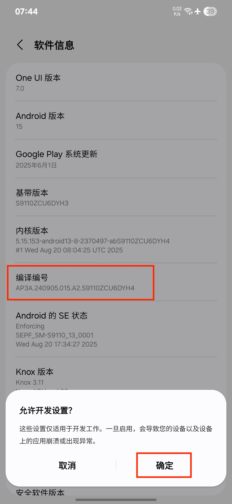

返回设置--打开开发者选项--开启 USB 调试

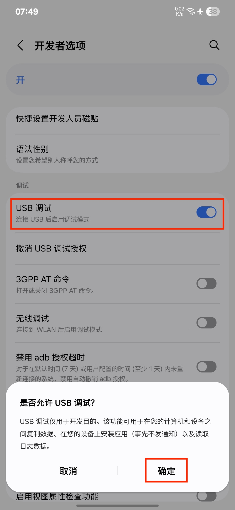

## 安装工具与驱动

本次刷机需要在 Windows 上进行

Linux 用户可以使用 [Vmware Workstation Pro](https://support.broadcom.com/group/ecx/productdownloads?subfamily=VMware%20Workstation%20Pro&freeDownloads=true) 虚拟一个 Win10 

Mac (x86) 上可能是我黑苹果 USB 接口适配问题 [VMware Fusion](https://support.broadcom.com/group/ecx/productdownloads?subfamily=VMware Fusion&freeDownloads=true) 虚拟 Win10 后无法连接手机

由于小编没有 arm 架构的 Mac 所以还请各位看官自行摸索

https://samfw.com/blog/download-odin-all-version

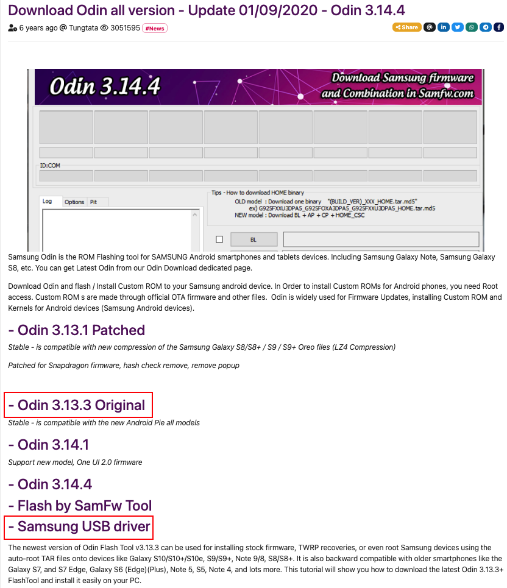

## 获取设备序列号并识别

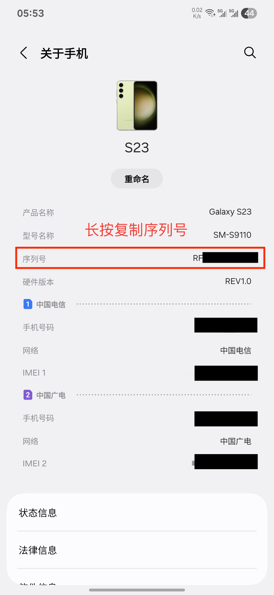

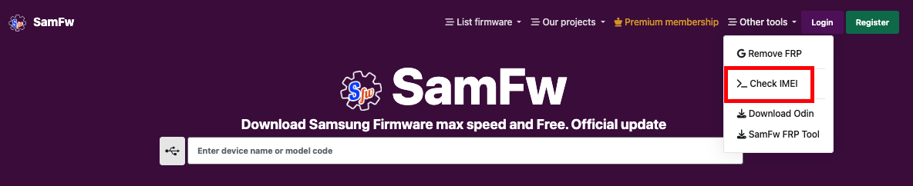

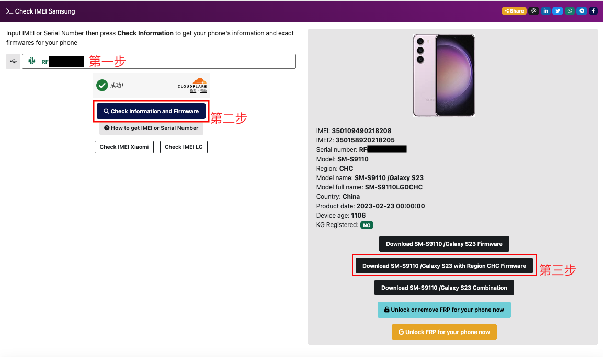

这里可以自行选择降级为国行、港行或台行

## 下载降级固件

下载固件一定要对应其二进制值数（Bit/SW REV.）二进制值数即是当前设备的基带版本号倒数第五位，否则无法降级

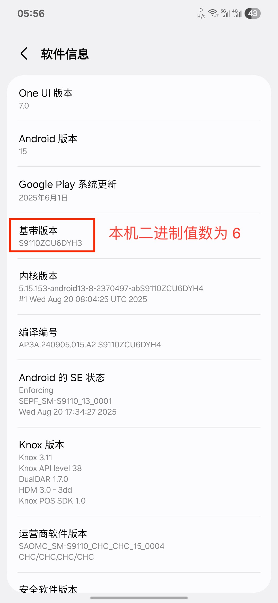

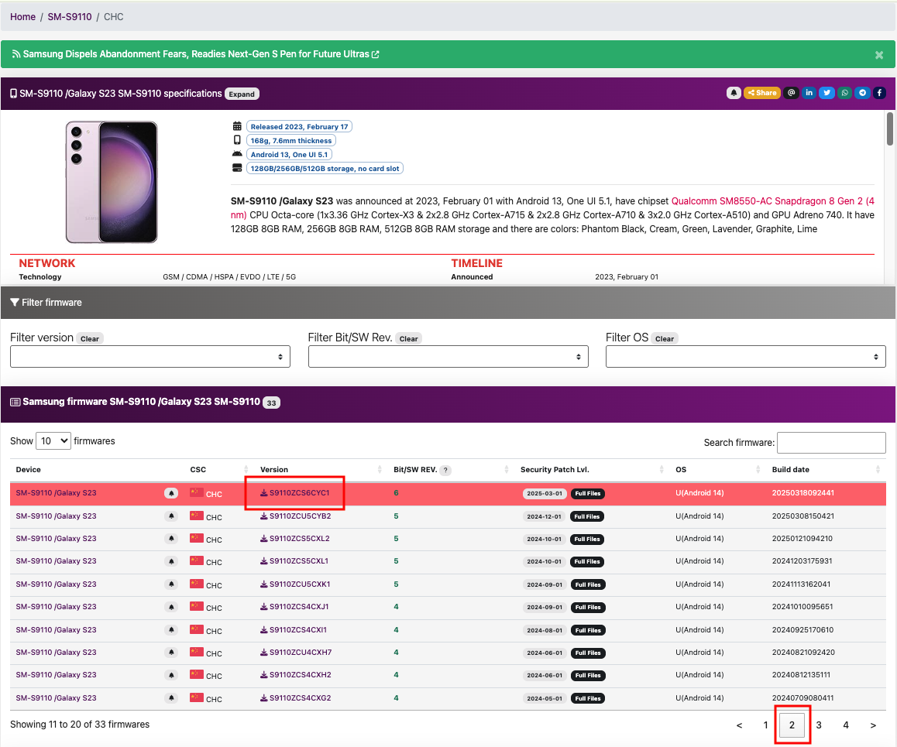

官方网页可查看本机更新日志

https://doc.samsungmobile.com/SM-S9110/025878230224/zho-cn.html

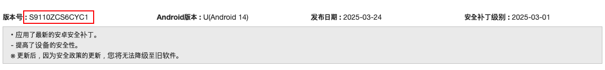

## 读取降级包固件

下载后您的电脑上需要存在以下三个压缩包

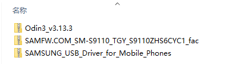

解压全部压缩包，先安装驱动，无脑下一步就行

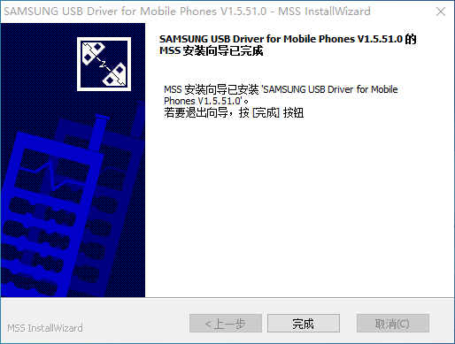

注意选择对应固件

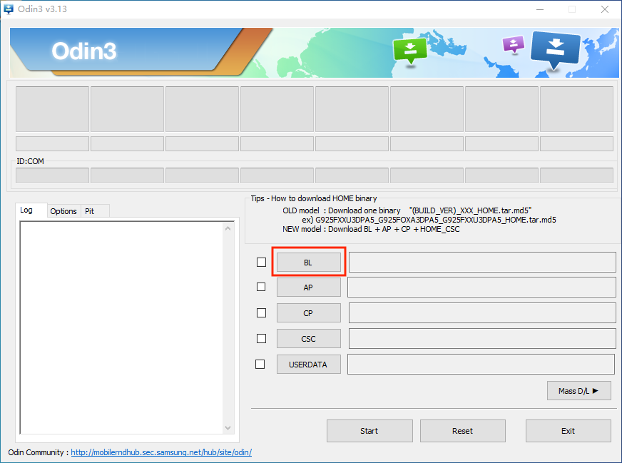

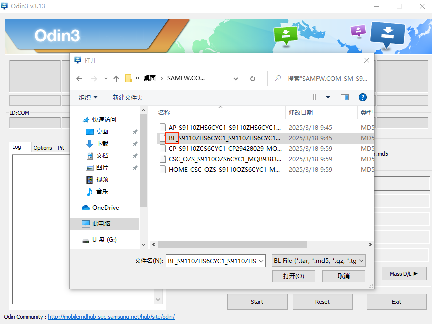

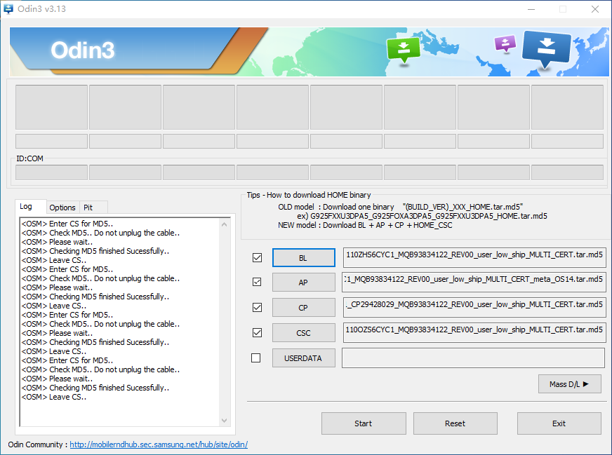

**注意：CSC 项千万不要选择 HOME_CSC !!!**

## 开始刷机

这时，数据线连接手机与电脑，重启手机之后同时按住 “音量 +” 和 “音量 -” 键

按 “音量 +” 来到如下界面

回到电脑，点击 “Start”

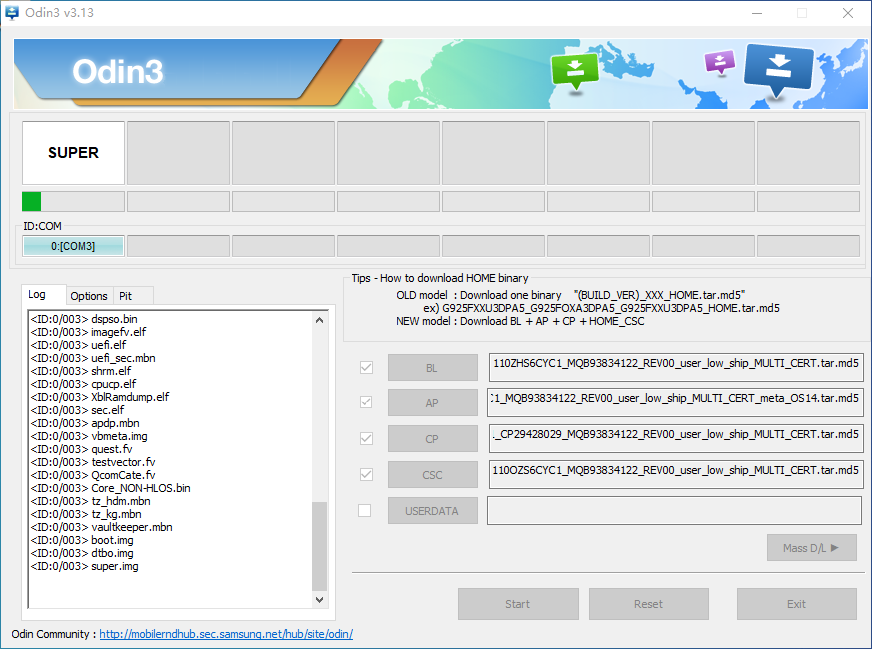

稍等片刻

结果应如下图

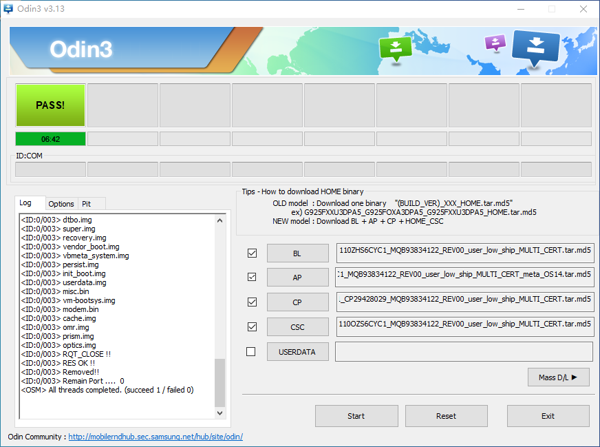

等待手机自动开机

初次进入系统连接 WI-FI 使用科学上网更快，多试几次失败会刷新 ”在离线状态下设置“ 

OK，本次教程就到这里，如果有问题可以留言

## --
