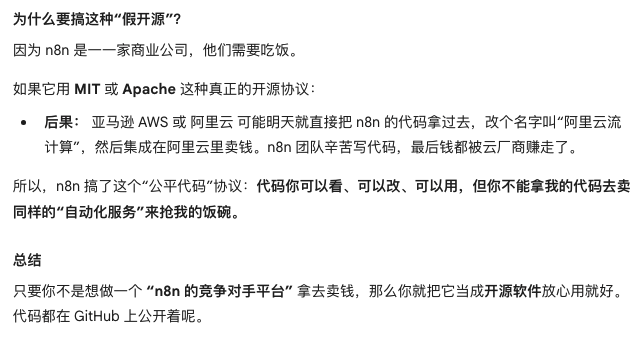

# n8n是什么？

**[n8n](https://github.com/n8n-io/n8n)** 是一个**“可视化自动流程设计器”**。

在 n8n 里写程序，不需要敲满屏幕的代码。你用**线**把它们连起来。数据就会顺着这根线流淌。

本质上，它把复杂的编程逻辑，变成了一个连连看游戏。

n8n 是 AI Agent 的“躯干”，这是 n8n 最近爆火的原因。

- **大模型 (LLM) 是大脑：** 会思考，但它没有手，没法帮你发邮件、查库存。
- **n8n 是躯干和手脚：** 负责连接真实世界的软件。



# 本地部署 n8n

```bash
docker volume create n8n_data
# 在 Docker 中创建一个名为 n8n_data 的持久化数据卷
# Docker 容器本质上是临时的。如果删除了 n8n 的容器，容器里所有的文件都会瞬间消失。n8n_data 就像是一个外挂硬盘。

docker run -it --rm \
 --name n8n \
 -p 5678:5678 \
 -e GENERIC_TIMEZONE="<Asia/Shanghai>" \
 -e TZ="<Asia/Shanghai>" \
 -e N8N_ENFORCE_SETTINGS_FILE_PERMISSIONS=true \
 -e N8N_RUNNERS_ENABLED=true \
 -e N8N_SECURE_COOKIE=false \
 -v n8n_data:/home/node/.n8n \
 docker.n8n.io/n8nio/n8n
# 启动 n8n 容器并挂载卷
# N8N_RUNNERS_ENABLED=true: 开启 Task Runners。这是 n8n 的高性能模式，处理大量并发任务时很有用。
# N8N_SECURE_COOKIE=false: 设置能够在局域网内打开
```


```bash

```

